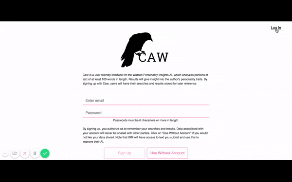

## Caw Full-Stack Application

>>"Now this is an inevitable truth: whatever you write will reveal your personality, and whatever you are will show through in your writing." - Brenda Ueland

Caw is a friendly user interface for the Watson Personality Insights AI. This AI takes in a portion of text containing more than 100 words and preferably over 1,200 words. With this, the AI provides some data about the author’s personality traits. Caw allows users to either plug in their text without logging in, or to create an account so that searches and results can be saved for future reference.

Note that this application was deployed on Heroku, a free hosting platform. If the page does not initially load, this is because the "dynos" are asleep. Please wait a few minutes, and you will be able to access the app. 

[Use the Application Here](https://shrouded-meadow-54760.herokuapp.com/)

Read the day-to-day progress on this application. 

[Comprehensive Build Notes on falondarville.com](https://falondarville.com/development-notes-for-caw/)

This application was presented to a group of over thirty people. 

[Presentation Slides](https://slides.com/falondarville/deck-1/live#/)

Please view my portfolio for more information about my other coding and creative projects. 

[Portfolio](https://falondarville.github.io/Portfolio/)

## Detailed Utility of the Application

From the homepage, the user will have the capability to sign up. She will also be able to click through to the search page without signing up. By signing up for the service, the user's searches will be stored and she will be able to access the search query and results at a later time by logging in. If the user opts not to create an account and log in prior to searching, her search will not be stored in the Caw database. However, the IBM Watson API may still store the search queries. 

The homepage of the application will detect whether or not the user is logged in. If she is logged in, the homepage will display a link to her past searches. If she is not logged in, the homepage will instead display a link to Log In. 

Whether or not the user has logged in, she will be able to perform searches on the analysis page. Here, she will add the search query to the search box and click the "Get your results" button. Within seconds, here results will populate below the search box and she will see a visual representation of the data from Watson. This data is structured as follow, as outlined by the Watson Personality Insights documentation. 

1. Big Five personality characteristics: Agreeableness, Conscientiousness, Extraversion, Emotional range, and Openness
2. Needs: Excitement, Harmony, Curiosity, Ideal, Closeness, Self-expression, Liberty, Love, Practicality, Stability, Challenge, and Structure
3. Values: Self-transcendence / Helping others, Conservation / Tradition, Hedonism / Taking pleasure in life, Self-enhancement / Achieving success, and Open to change / Excitement

If a user is logged in, she can access her past searches on a single listing page. The searches are displayed with the most recent search showing at the top. She can click on any of the detail panels and view the entire search query and results on a detail page. 

## Technologies and Methods Used

This project was built using React.js, JavaScript, Bootstrap 4, HTML and CSS, React Router for directing the proper components to their URLs, Express for the server, MySQL for the database, Sequelize to create the database models and ORM structure, and axios for front-end requests to the back-end.

I used three packages in this application that I have not used previously:

1. personality-sunburst-chart handles the graphical representation of the Watson Personality Insights data
2. sweet-alert is an easy way to add a beautifully styled alert. I used this to notify users that they have successfully created an account and prompt them to sign in

As for organizing the project, I used GitHub’s built-in Projects tab, which allows you to create a project tied to a specific repository. I created several columns including: To Do, In Progress, and Completed. I also created a daily diary of my progress, a copy of which appears below. On top of that, I keep written lists and notes in a notebook. I committed to GitHub often and used commit names that were logical, descriptive, and concise.

## Challenges and Learning Summary

This project started out at a React Native application. However, given that the MVP was due within several days of me beginning, I chose to change course and build a React application instead. The reason being that I had a difficult time making progress on the original plan for the application, specifically the Twitter log in. Please refer to the proposal to see how much the application was divergent from the end result.

Building USUME prior to this application gave me a strong foundation for this project. There were many similar pieces: the passport configuration and usage, the overall structure of relation between the Express server and the React front-end, and the sign up and login logic.

The Watson Personality Insights AI was easy to work with and well documented. I knew that I wanted to visualize the data for the users, and looked into chart.js and canvas do accomplish this. However, I did not end up having to create my own visualization. I used a package that took the data from the API response and populated a sunburst chart. This package saved me a lot of time and trouble, and really emphasizes the community aspect of coding. Without the effort that those developers went through to create that package, I would have had a lot more work to do.

## Literary Influence

>>"All writers, by the way they use the language, reveal something of their spirits, their habits, their capacities, and their biases." - William Strunk Jr.

This application was strongly influenced by my fascination with what writers reveal through their work. I have spent a lot of time thinking about what part of writing comes from what an author can be trying to mask or keep out of his work. There is perhaps no act so personal that comes to light and can garner so much attention for its hidden or plain residues from the originator (the author in this case). 
